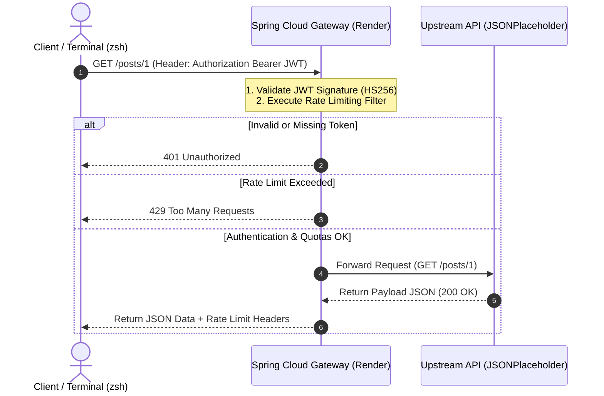

# Spring Cloud Gateway - JWT Authentication & Rate Limiter

A cloud-deployed API Gateway built with **Spring Cloud Gateway** and hosted on **Render**. It serves as an entry point for microservices, handling centralized **JWT authentication** and request rate limiting before forwarding traffic to upstream APIs.

---

## Architecture & Security Workflow

When a client makes a request, the Gateway intercepts it and performs two core security checks before proxying the call to the upstream service:

1. **JWT Signature Verification:** Validates the incoming `Authorization: Bearer <token>` against a shared secret key using the **HS256** algorithm.
2. **Rate Limiting:** Checks request frequency against active thresholds using custom reactive filters.



---

## Tech Stack

* **Java / Spring Boot:** Spring Cloud Gateway (Reactive WebFlux stack)
* **Authentication:** Custom JWT Filter (HS256 HMAC)
* **Deployment Platform:** Render
* **Testing Tools:** Node.js (`jsonwebtoken`), cURL, Zsh/Linux

---

## Local Testing & Verification

To verify the gateway authentication flow locally, follow these steps:

### 1. Generate a JWT Token
Generate an HS256 signed token using Node.js directly from your terminal:

```zsh
TOKEN=$(node -e 'console.log(require("jsonwebtoken").sign({sub: "1234567890", name: "Henrique", admin: true}, "YOUR_JWT_SECRET_HERE"))')
```

### 2. Verify Token Variable
Ensure the token was successfully generated and stored:

```zsh
echo $TOKEN
```

### 3. Send Authenticated Request
Execute an HTTP request passing the token through the `Authorization` header:

```zsh
curl -i -H "Authorization: Bearer $TOKEN" [https://rate-limiter-gateway-chnv.onrender.com/posts/1](https://rate-limiter-gateway-chnv.onrender.com/posts/1)
```

### Expected Response
A successful request will return an `HTTP/2 200 OK` status, active `x-ratelimit-*` headers, and the proxied JSON payload:

```http
HTTP/2 200 OK
content-type: application/json; charset=utf-8
x-ratelimit-limit: 1000
x-ratelimit-remaining: 999

{
  "userId": 1,
  "id": 1,
  "title": "sunt aut facere repellat provident occaecati excepturi optio reprehenderit",
  "body": "quia et suscipit..."
}
```
